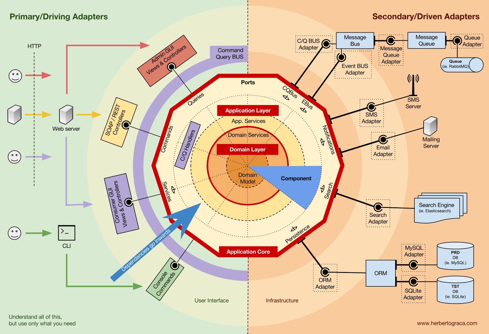

# Market Status API REST

The Market Status API REST project is a Node.js application that provides market information for trading pairs. It follows the principles of clean architecture and is implemented using TypeScript. The goal of this project is to create a public API that retrieves the tips of the orderbook and evaluates market depth for specified trading pairs.

## Application arquitecture


The application follows the principles of Hexagonal Architecture, also known as Ports and Adapters Architecture. This architectural approach promotes layer independence and facilitates testing and maintenance. The core of the application, which contains the business logic and rules, is decoupled from the external adapters such as user interfaces, databases, and external services.

This is an example of the main file, where changing the exchange is as simple as changing one line of code:
```typescript
  import { Bitfinex } from "./infrastructure/driven/exchanges/bitfinex/bitfinex";
  import { ExpressDriver } from "./infrastructure/drivers/http/expressDriver";

  ExpressDriver.with({
          port: 3005,
          exchange: Bitfinex.getInstance()
  }).execute();
```
Additionally, a DummyExchange has been added, which can be used as a mock without having to change any other code:
```typescript
  import { MockedExchange } from "./infrastructure/driven/exchanges/dummy/mockedExchange";
  import { ExpressDriver } from "./infrastructure/drivers/http/expressDriver";

  ExpressDriver.with({
          port: 3005,
          exchange: MockedExchange.getInstance()
  }).execute();

```
By adopting this Application Architecture, the project achieves modularity, maintainability, and scalability, making it easier to evolve and adapt to future requirements.


For further information, you can explore resources on Hexagonal Architecture, such as:

-   [Hexagonal Architecture by Alistair Cockburn](https://alistair.cockburn.us/hexagonal-architecture/)
-   [Hexagonal Architecture by Wikipedia](https://en.wikipedia.org/wiki/Hexagonal_architecture)
-   [The Clean Architecture by Robert C. Martin](https://blog.cleancoder.com/uncle-bob/2012/08/13/the-clean-architecture.html)


## Specifications

- The server is implemented using Node.js version 18.16.0.

- The API exposes the following endpoints:

1. **GET /orderbook?pairName=:pair&depth=:depth**: This endpoint receives a pair name and a depth value and retrieves the tips of the orderbook via HTTP. Additionally, it subscribes to the WebSocket (WSS) of the exchange to begin synchronizing the orderbook in memory. The response will include the order book information.

The order book synchronization process involves validating the checksums of the local order book and the WebSocket stream to ensure data consistency.

Once the order book is synchronized in memory after the initial request, subsequent requests for the order book achieve significantly improved response times, typically ranging from 2ms to 3ms, as opposed to the initial 400ms response time.

   - Example request: `GET ?depth=25&pairName=ETH-USD`
   - Response body:
     ```json
      {
        "bids": [
          {
            "price": 1807,
            "count": 1,
            "amount": 121.87
          },
          {
            "price": 1808,
            "count": 1,
            "amount": 0.28868723
          },
          {
            "price": 1809,
            "count": 4,
            "amount": 7.63427228
          },
          {
            "price": 1809.7,
            "count": 9,
            "amount": 13.15365578
          },
          {
            "price": 1809.6,
            "count": 1,
            "amount": 0.507
          },
          {
            "price": 1809.5,
            "count": 2,
            "amount": 5.56312
          },
          {
            "price": 1809.4,
            "count": 1,
            "amount": 2.76328
          },
          {
            "price": 1809.3,
            "count": 2,
            "amount": 1.57653018
          },
          {
            "price": 1809.2,
            "count": 2,
            "amount": 2.31175633
          },
          {
            "price": 1809.1,
            "count": 4,
            "amount": 8.23395548
          },
          {
            "price": 1808.9,
            "count": 3,
            "amount": 33.05863905
          },
          {
            "price": 1808.7,
            "count": 5,
            "amount": 16.25338081
          },
          {
            "price": 1808.6,
            "count": 1,
            "amount": 3.317
          },
          {
            "price": 1808.5,
            "count": 1,
            "amount": 2.39719565
          },
          {
            "price": 1808.4,
            "count": 3,
            "amount": 75.46456427
          },
          {
            "price": 1807.9,
            "count": 1,
            "amount": 0.867852
          },
          {
            "price": 1807.8,
            "count": 2,
            "amount": 5.76561571
          },
          {
            "price": 1807.7,
            "count": 3,
            "amount": 93.85556043
          },
          {
            "price": 1807.4,
            "count": 1,
            "amount": 2.212
          },
          {
            "price": 1807.3,
            "count": 4,
            "amount": 14.8410746
          },
          {
            "price": 1807.1,
            "count": 1,
            "amount": 2.59291768
          },
          {
            "price": 1806.9,
            "count": 1,
            "amount": 35
          },
          {
            "price": 1808.3,
            "count": 1,
            "amount": 2.88328916
          },
          {
            "price": 1806.6,
            "count": 1,
            "amount": 5.27374168
          },
          {
            "price": 1808.8,
            "count": 1,
            "amount": 1.74064557
          }
        ],
        "asks": [
          {
            "price": 1810,
            "count": 1,
            "amount": 2.8004
          },
          {
            "price": 1811,
            "count": 3,
            "amount": 6.13211
          },
          {
            "price": 1812,
            "count": 1,
            "amount": 2.7436437
          },
          {
            "price": 1809.8,
            "count": 6,
            "amount": 2.03514149
          },
          {
            "price": 1809.9,
            "count": 2,
            "amount": 3.43590657
          },
          {
            "price": 1810.1,
            "count": 2,
            "amount": 7.26461943
          },
          {
            "price": 1810.2,
            "count": 2,
            "amount": 4.106163
          },
          {
            "price": 1810.3,
            "count": 2,
            "amount": 7.5562661
          },
          {
            "price": 1810.4,
            "count": 2,
            "amount": 2.91123311
          },
          {
            "price": 1810.5,
            "count": 6,
            "amount": 39.7069436
          },
          {
            "price": 1810.6,
            "count": 4,
            "amount": 3.27203247
          },
          {
            "price": 1810.7,
            "count": 2,
            "amount": 16.7541
          },
          {
            "price": 1810.8,
            "count": 2,
            "amount": 2.86134
          },
          {
            "price": 1810.9,
            "count": 2,
            "amount": 0.1221654
          },
          {
            "price": 1811.1,
            "count": 2,
            "amount": 3.45694219
          },
          {
            "price": 1811.2,
            "count": 4,
            "amount": 67.09547233
          },
          {
            "price": 1811.3,
            "count": 1,
            "amount": 27.6056
          },
          {
            "price": 1811.4,
            "count": 1,
            "amount": 0.1
          },
          {
            "price": 1811.5,
            "count": 2,
            "amount": 1.54305533
          },
          {
            "price": 1811.6,
            "count": 3,
            "amount": 95.42390431
          },
          {
            "price": 1811.7,
            "count": 1,
            "amount": 0.1
          },
          {
            "price": 1811.8,
            "count": 1,
            "amount": 0.1
          },
          {
            "price": 1811.9,
            "count": 2,
            "amount": 0.60591715
          },
          {
            "price": 1812.1,
            "count": 2,
            "amount": 0.17651762
          },
          {
            "price": 1812.2,
            "count": 2,
            "amount": 35.5528
          }
        ]
      }
     ```
2. **POST /order**: This endpoint is called with the pair name, operation type (buy/sell), and the amount to be traded. It returns the effective price that will result if the order is executed. The effective price is determined based on the bids (for buy) or asks (for sell) from the order book.

   - Example buy request: `POST /order`
   - Request body:
     ```json
      {
          "side":"buy",
          "pairName":"BTCUSD",
          "amount":1
      }
     ```
   - Example response:
     ```json
      {
          "filled_qty": 1,
          "remaining_qty": 0,
          "effective_price": 25855,
          "symbol": "BTCUSD"
      }
     ```

   - Example sell request: `POST /order`
   - Request body:
     ```json
      {
          "side":"sell",
          "pairName":"BTCUSD",
          "amount":1
      }
     ```
   - Example response:
     ```json
      {
          "filled_qty": 1,
          "remaining_qty": 0,
          "effective_price": 25919.033421810003,
          "symbol": "BTCUSD"
      }
     ```
   - Example bad request:
     ```json
      {
          "side":"sell",
          "pairName":"UNKNOWN-USD",
          "amount":1
      }
     ```
   - Example bad request response:
     ```
      symbol: invalid
     ```
3. **POST /order (with limit)**: This endpoint allows adding a limit to the effective price of the order. It returns the amount of purchase or sale that can be made with the specified pair.

   - Example buy request: `POST /order`
   - Request body:
     ```json
      {
          "side":"buy",
          "pairName":"BTCUSD",
          "limit":30000
      }
     ```
   - Example response:
     ```json
      {
          "filled_qty": 1.128625710093676,
          "effective_price": 30000,
          "symbol": "BTCUSD"
      }
     ```
   - Example sell request: `POST /order`
   - Request body:
     ```json
      {
          "side":"sell",
          "pairName":"BTCUSD",
          "limit":30000
      }
     ```
   - Example response:
     ```json
      {
          "filled_qty": 1.1559553206180773,
          "effective_price": 30000,
          "symbol": "BTCUSD"
      }
     ```

## How to Run the Docker Image

Follow the steps below to build the Docker image:

1. Open a terminal or command prompt.

2. Build the image 
  ```docker build -t your-image-name .```

3. Run it 
  ```docker run -p 3005:3005 your-image-name```